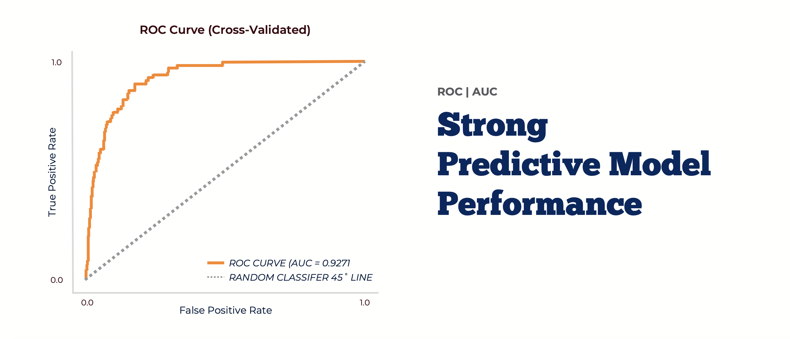

# 🏀 NIL Score & NCAA Basketball Performance Analysis

This project investigates how **Name, Image, and Likeness (NIL)** valuations relate to **player and team performance** in NCAA Division I men's basketball. The objective is to provide **actionable insights** for real-world stakeholders involved in scouting, talent management, and NIL strategy.

> 📌 Note: All data processing and model execution were conducted in a secure credentialed environment (VM). Due to data agreements, **raw data and source code are not publicly available**.

---

## 🎯 Target Audience

This project is designed to support decision-making for the following stakeholders:

- 🏀 **Basketball Team Business Development Teams**  
  To guide NIL partnership strategies, identify under/overvalued players, and optimize recruitment targets.

- 🤝 **Sports Agencies & Talent Managers**  
  To discover rising prospects with NIL potential and allocate resources effectively for athlete promotion.

- 📊 **NIL Collectives and Sponsoring Partners**  
  To evaluate athlete ROI and improve NIL deal structures using performance-driven metrics.

---

## 📈 Project Objectives

- Quantify the correlation between NIL valuations and player/team success
- Build a framework to cluster teams based on NIL sensitivity and key drivers
- Predict which athletes are likely to rise into NIL Top 100 rankings using machine learning

<p align="center">
  <a href="/NIL_Impact_TeamPresentation.pdf">
    
</p>

---

## 🔍 Analysis Procedure

### 1. Correlation Analysis (2019–2022)
- Examined initial NIL policy impact using historical player performance metrics.
- Identified a **statistically significant positive correlation** between NIL scores and on-court metrics.
- Split teams into **three tiers** to observe NIL-driven performance shifts.

### 2. Expanded Dataset (2023–2025)
- Collected current NCAA and NIL data through web scraping (On3 and NCAA official sources).
- Ensured insights reflect the **current NIL market**, useful for ongoing strategic decisions.

### 3. Team-Level Clustering
- Applied unsupervised learning to group teams by NIL sensitivity and roster composition.
- Enables customized team strategies based on NIL driver variables.

### 4. Player-Level Predictive Modeling
- Built a binary classification model to predict which players are likely to enter **Top 100 NIL valuation tiers**.
- Used ensemble models (**Random Forest, LightGBM, XGBoost**) and achieved **AUC = 0.9271**.

<p align="center">
  <a href="/NIL_Impact_TeamPresentation.pdf">
    
  </a>
</p>

---

## 📄 License & Usage

This repository is for **portfolio and educational purposes only**.  

- Code and data used for modeling are **not included** due to credential protection.
- The **team presentation** is proprietary and **not for redistribution or reuse**.

📁 See [`/presentation/README.md`](./presentation/README.md) for full usage disclaimer.

---

## 📂 Folder Structure

```plaintext
.
├── README.md
├── LICENSE.md
├── NIL_Impact_Presentation_Slide.pdf
├── NIL_Impact_Presentation.mp4
